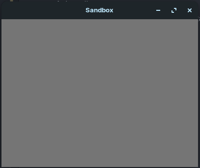

# Sandbox

Esse projeto é o trabalho final da matéria Linguagens de Programação da UNB. A ideia é um simulador de particulas 2D com pixels (não literais), onde cada tipo de pixel tem um comportamento diferente.

## Rodando o projeto

1. Intale o [rust](https://www.rust-lang.org/pt-BR/learn/get-started).
2. Instale as dependencias (para evitar esse [erro](https://github.com/plotters-rs/plotters/issues/10))
   1. libfontconfig
   2. libfontconfig1-dev
3. Rode o projeto com `cargo run`

Com isso você deve ter a tela abaixo e já pode testar as diferentes particulas.

# Abrindo Wiki/Documentação

`cargo doc --no-deps --open`